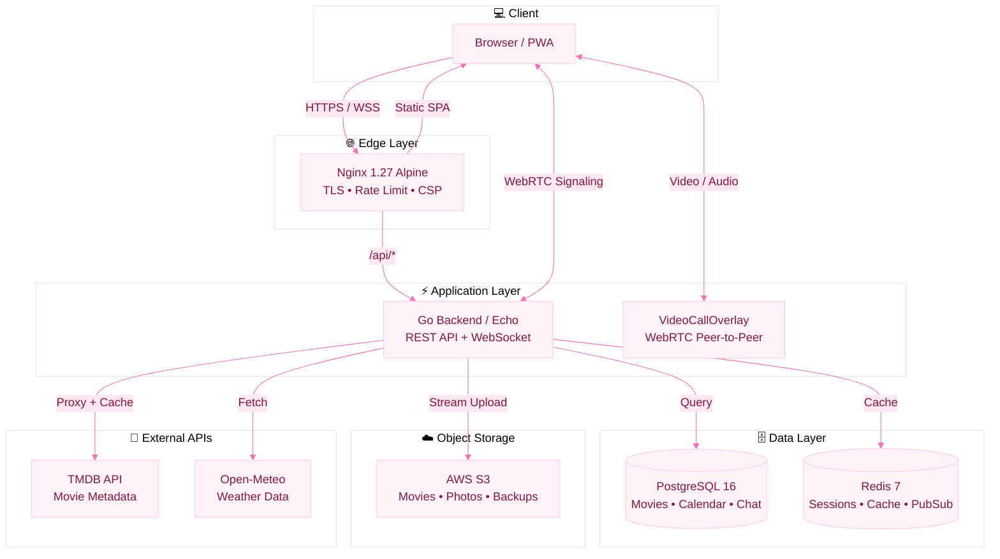

<div align="center">

<!-- Animated Header SVG -->
<svg width="100%" height="200" viewBox="0 0 800 200" xmlns="http://www.w3.org/2000/svg">
  <defs>
    <linearGradient id="bgGrad" x1="0%" y1="0%" x2="100%" y2="100%">
      <stop offset="0%" style="stop-color:#fdf2f8;stop-opacity:1" />
      <stop offset="50%" style="stop-color:#fce7f3;stop-opacity:1" />
      <stop offset="100%" style="stop-color:#fbcfe8;stop-opacity:1" />
    </linearGradient>
    <radialGradient id="glow" cx="50%" cy="50%" r="50%">
      <stop offset="0%" style="stop-color:#be185d;stop-opacity:0.3" />
      <stop offset="100%" style="stop-color:#be185d;stop-opacity:0" />
    </radialGradient>
    <filter id="blur">
      <feGaussianBlur stdDeviation="2" />
    </filter>
  </defs>
  
  <!-- Background -->
  <rect width="800" height="200" fill="url(#bgGrad)" rx="20"/>
  
  <!-- Floating hearts -->
  <g opacity="0.6">
    <path d="M50 160 C50 150, 40 140, 30 140 C15 140, 10 155, 10 165 C10 180, 30 195, 50 210 C70 195, 90 180, 90 165 C90 155, 85 140, 70 140 C60 140, 50 150, 50 160" fill="#be185d" filter="url(#blur)">
      <animateTransform attributeName="transform" type="translate" values="0,0; 0,-15; 0,0" dur="4s" repeatCount="indefinite"/>
      <animate attributeName="opacity" values="0.6;0.3;0.6" dur="4s" repeatCount="indefinite"/>
    </path>
  </g>
  
  <g opacity="0.4">
    <path d="M720 50 C720 42, 713 35, 705 35 C694 35, 690 46, 690 53 C690 64, 705 75, 720 85 C735 75, 750 64, 750 53 C750 46, 746 35, 735 35 C727 35, 720 42, 720 50" fill="#e11d48">
      <animateTransform attributeName="transform" type="translate" values="0,0; 0,12; 0,0" dur="5s" repeatCount="indefinite" begin="1s"/>
      <animate attributeName="opacity" values="0.4;0.15;0.4" dur="5s" repeatCount="indefinite" begin="1s"/>
    </path>
  </g>
  
  <g opacity="0.5">
    <path d="M150 40 C150 32, 143 25, 135 25 C124 25, 120 36, 120 43 C120 54, 135 65, 150 75 C165 65, 180 54, 180 43 C180 36, 176 25, 165 25 C157 25, 150 32, 150 40" fill="#fb7185">
      <animateTransform attributeName="transform" type="translate" values="0,0; 0,-10; 0,0" dur="3.5s" repeatCount="indefinite" begin="0.5s"/>
    </path>
  </g>
  
  <g opacity="0.35">
    <path d="M650 140 C650 132, 643 125, 635 125 C624 125, 620 136, 620 143 C620 154, 635 165, 650 175 C665 165, 680 154, 680 143 C680 136, 676 125, 665 125 C657 125, 650 132, 650 140" fill="#be185d">
      <animateTransform attributeName="transform" type="translate" values="0,0; 0,8; 0,0" dur="4.5s" repeatCount="indefinite" begin="2s"/>
    </path>
  </g>
  
  <!-- Pulsing glow circles -->
  <circle cx="400" cy="100" r="60" fill="url(#glow)">
    <animate attributeName="r" values="55;70;55" dur="3s" repeatCount="indefinite"/>
    <animate attributeName="opacity" values="0.5;0.2;0.5" dur="3s" repeatCount="indefinite"/>
  </circle>
  
  <!-- Central heart -->
  <g transform="translate(400, 100)">
    <path d="M0 -25 C-15 -40, -35 -30, -35 -10 C-35 10, -15 25, 0 40 C15 25, 35 10, 35 -10 C35 -30, 15 -40, 0 -25" fill="#be185d">
      <animateTransform attributeName="transform" type="scale" values="1;1.08;1" dur="2s" repeatCount="indefinite"/>
    </path>
    <animateTransform attributeName="transform" type="translate" values="400 100; 400 95; 400 100" dur="2s" repeatCount="indefinite"/>
  </g>
  
  <!-- Title text -->
  <text x="400" y="170" font-family="serif" font-size="36" font-weight="bold" fill="#831843" text-anchor="middle" letter-spacing="2">RINA</text>
  <text x="400" y="188" font-family="sans-serif" font-size="11" fill="#9d174d" text-anchor="middle" letter-spacing="4" opacity="0.8">A PRIVATE SANCTUARY FOR TWO</text>
  
  <!-- Sparkle dots -->
  <circle cx="250" cy="80" r="2" fill="#be185d" opacity="0.6">
    <animate attributeName="opacity" values="0;0.8;0" dur="2s" repeatCount="indefinite"/>
  </circle>
  <circle cx="550" cy="60" r="1.5" fill="#e11d48" opacity="0.6">
    <animate attributeName="opacity" values="0;0.8;0" dur="2.5s" repeatCount="indefinite" begin="0.7s"/>
  </circle>
  <circle cx="320" cy="130" r="1.5" fill="#fb7185" opacity="0.5">
    <animate attributeName="opacity" values="0;0.7;0" dur="3s" repeatCount="indefinite" begin="1.2s"/>
  </circle>
  <circle cx="480" cy="45" r="2" fill="#be185d" opacity="0.4">
    <animate attributeName="opacity" values="0;0.6;0" dur="2.2s" repeatCount="indefinite" begin="0.3s"/>
  </circle>
</svg>

<br />

<!-- Animated Typing -->
<a href="https://rina.devopsya.com">
  
</a>

<br /><br />

<!-- Animated Status Badges -->


<br /><br />

<!-- Live Site Badge -->
<a href="https://rina.devopsya.com">
  
</a>
<a href="https://github.com/MarOOnREPO/Rina/actions">
  
</a>

</div>

---

## ✨ What is Rina?

<div align="center">

> *"Every pixel, every protocol, and every encryption key exists to make long distance feel like zero distance."*

</div>

**Rina** is a bespoke, security-hardened ecosystem engineered for two people in a long-distance relationship. It is not a generic chat app — it is a private sanctuary where every feature is designed to bridge the gap between two hearts across timezones.

- 🌍 **Dual-timezone aware** — Live clocks for Kenitra (WET) & Perm (YEKT) with weather
- 🔒 **Zero third-party data** — Everything stays on your own VPS
- 💕 **Couple-first design** — No groups, no public feeds, just you two
- 🎬 **Shared experiences** — Watch movies, video call, whiteboard, and jam to Spotify together

---

## 🏛️ Live Architecture



---

## 🚀 Features Showcase

<table>
<tr>
<td width="50%" valign="top">

### 💬 Chat & Presence
- Real-time messaging via WebSocket
- Typing indicators & online presence orb
- **In-chat video calls** — WhatsApp-style overlay
- "Thinking of You" love ping with haptic feedback
- Reply threads & message actions

### 📅 Shared Life
- **Smart Calendar** — Event pills on month grid, today highlight
- **Cycle Tracker** — Phase visualization with predictions
- **Dual-Timezone Dashboard** — Live clocks + weather
- **Countdowns** — Visit timers with location pinning

</td>
<td width="50%" valign="top">

### 🎬 Movies & Entertainment
- **TMDB Discovery** — Browse Popular, Top Rated, Upcoming, Now Playing
- **Upload Library** — Drag & drop with real-time progress (speed + ETA)
- **Watchlist** — One-click add from TMDB
- **Cast Carousels** — Horizontal scroll with profile photos
- **YouTube Trailers** — In-modal embed with nocookie domain

### 🎮 Play Together
- **Co-Video** — WebRTC P2P with mute/video/PIP
- **Spotify Jam** — Shared playback control
- **Whiteboard** — Real-time collaborative canvas
- **YouTube Sync** — Watch videos together

</td>
</tr>
</table>

---

## 🎨 Design System

<div align="center">

| Element | Value |
|---------|-------|
| **Primary** | `rose-600` `#E11D48` |
| **Accent** | `pink-700` `#BE185D` |
| **Surface** | `pink-50` → `pink-100` gradient |
| **Typography** | Playfair Display (headings) + Inter (body) |
| **Effects** | Glassmorphism, backdrop-blur, soft shadows |
| **Motion** | 60fps micro-interactions, spring physics |

</div>

---

## 🛠️ Local Development

### Prerequisites
- **Node.js** `>=20`
- **Go** `>=1.23`
- **Docker** & **Docker Compose**

### Quick Start

```bash
# 1. Clone
git clone https://github.com/MarOOnREPO/Rina.git && cd Rina

# 2. Configure
cp .env.example .env
# Edit .env: POSTGRES_PASSWORD, JWT_SECRET, COOKIE_SECRET,
#            MAROON_PASSWORD_HASH, RINA_PASSWORD_HASH,
#            TMDB_API_KEY, AWS credentials...

# 3. Start infrastructure
docker compose up -d postgres redis

# 4. Run Go migrations
cd go-backend
./migrate

# 5. Start backend dev
cd go-backend && go run ./cmd/server

# 6. Start frontend dev
cd frontend && npm install && npm run dev
```

| Service | URL |
|---------|-----|
| Frontend | http://localhost:5173 |
| Backend API | http://localhost:8080 |

---

## ☁️ Production Deploy

### Fresh VPS (Ubuntu 22.04+)

```bash
git clone https://github.com/MarOOnREPO/Rina.git && cd Rina
cp .env.example .env
# Fill in ALL values
./scripts/install.sh
```

### Update Existing VPS

```bash
cd ~/Rina
git pull origin main
./scripts/deploy.sh
```

Or simply push to `main` — **GitHub Actions** handles the rest:
- ✅ Lint & type-check
- ✅ Build frontend + Go backend
- ✅ Run tests
- ✅ Deploy via SSH
- ✅ Health check verification

---

## 🔐 Security Highlights

- **Cookie-based JWT** — `HttpOnly` + `Secure` + `SameSite=Strict`
- **AES-256-GCM** — Spotify tokens encrypted at rest
- **Rate Limiting** — Redis-backed API & login throttling
- **CSP Headers** — Strict content security policy
- **Isolated Workers** — Cinema worker has zero DB access
- **Encrypted Backups** — GPG-encrypted DB dumps to S3

---

## 📁 Project Structure

```
Rina/
├── frontend/                  # SvelteKit 2 + Svelte 5 + Tailwind
│   ├── src/routes/            # Pages (movies, chat, calendar...)
│   ├── src/lib/components/    # Reusable components
│   └── build/                 # Static output (nginx serves this)
├── go-backend/                # Go + Echo Framework
│   ├── cmd/server/            # HTTP server entry
│   ├── cmd/migrate/           # DB migration runner
│   ├── internal/handlers/     # HTTP handlers
│   ├── internal/services/     # Business logic (S3, TMDB)
│   └── migrations/            # SQL migrations
├── nginx/                     # Reverse proxy configs
├── scripts/                   # Deploy, backup, SSL helpers
├── docker-compose.yml         # Production stack
└── .github/workflows/         # CI/CD pipelines
```

---

<div align="center">

<!-- Animated Footer -->
<svg width="400" height="60" viewBox="0 0 400 60" xmlns="http://www.w3.org/2000/svg">
  <text x="200" y="30" font-family="serif" font-size="14" fill="#9d174d" text-anchor="middle" opacity="0.8">
    Architected with care by MarOOn
    <animate attributeName="opacity" values="0.8;0.4;0.8" dur="3s" repeatCount="indefinite"/>
  </text>
  <path d="M185 40 C185 35, 180 30, 175 30 C168 30, 165 36, 165 40 C165 46, 175 52, 185 58 C195 52, 205 46, 205 40 C205 36, 202 30, 195 30 C190 30, 185 35, 185 40" fill="#be185d" opacity="0.5">
    <animateTransform attributeName="transform" type="scale" values="1;1.1;1" dur="2s" repeatCount="indefinite"/>
  </path>
  <text x="200" y="55" font-family="sans-serif" font-size="10" fill="#be185d" text-anchor="middle" opacity="0.6">
    for Rina 💕
  </text>
</svg>

<br />

<a href="https://rina.devopsya.com">🌐 rina.devopsya.com</a>

</div>
